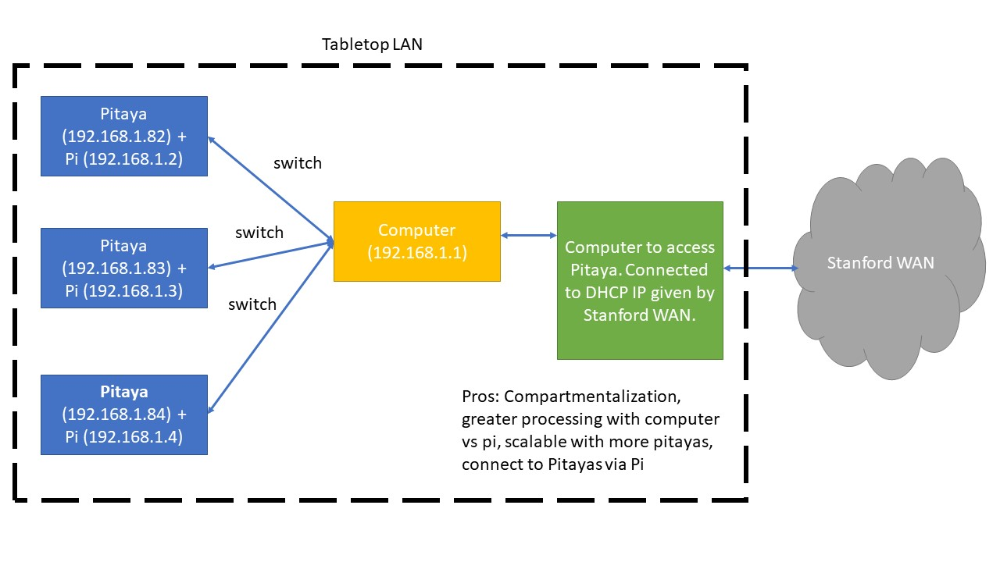

# Tabletop Multi-Connect

Overview: Allow for tabetop systems to be remotely accessible. This necessitates for the pitaya (console) to have unique IP addresses and centralized computer to act as default gateway.  

## How to change Pitaya IP address via software?

There a couple file that handle IP configuration for pitaya. 

There is resolv.conf located in /etc folder. This should not be edited. Inside of it should be "nameserver 192.168.1.1". This file informs the pitaya to search for default gateway IP 192.168.1.1 for network communication.

The second file in /etc/network/interfaces. This file allows us to change the static IP address. The provided interfaces file is the modified version for the pitaya to have IP address 192.168.1.82. Note: lines 19-20 are commented so that pitaya does not connect with DHCP and line 27 allows us to change the IP address.

For more information on changing the pitaya IP address: https://mxii.eu.org/2016/03/18/redpitaya-direct-connection/ 

For more pitaya documentation: https://docs.rs-online.com/8175/0900766b8144a693.pdf

## How to edit these files on Pitaya?

We can use vi (not vim) on the pitaya. That is the only reasonable editor installed.

I think it is reasonable to remove the SD card from the pitaya (just need to push it in a little and it will bounce out). Then load the SD card into a micro-SD card reader and load it into a linux virtual machine or machine. Then you can mount the drive onto the computer and edit the file. I ran into memory issues with editing files, so I had to remove CMake in /usr/share directory to get some space. There is no dynamic allocation that occurs when mounting the drive externally and not booting into it.

## How to edit IP address on PI?

We need to change IP address for the raspberry pi so that we use both the remote connection and pi can access the pitaya and thereby the scanner. This modification still needs to be implemented.

## Other ideas?

We were thinking initially to try connecting to the Pi via usb debugging, but that more complicated than a network based ssh connection. So this method allows for remote debugging as well. 

